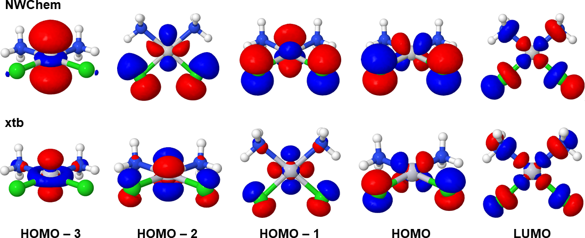

# Illustrations of NWChem calculations
[NWChem](https://nwchemgit.github.io/) is an *ab initio* computational
chemistry software package that has been designed to run on high-performance 
parallel supercomputers as well as conventional workstations. This document 
illustrates the basic use of `NWChem` for tasks such as geometry 
optimizations, energy comparisons, and analysis of molecular orbitals.

## Installing NWChem

### Fedora

Only MPI parallel versions of NWChem are available for Fedora at the moment.
They come in two flavors: [Open MPI](https://www.open-mpi.org) and [MPICH](https://www.mpich.org).

To install the Open MPI version `NWChem` on Fedora Linux, simply open a terminal and execute
```
dnf install nwchem-openmpi
```

`NWChem` jobs can be run as follows:
```
module load mpi/openmpi
nwchem_openmpi input.in > output.out 
```

A parallel job with four CPU cores (`-np 4`) can be run with 
```
module load mpi/openmpi
mpirun -np 4 nwchem_openmpi input.in > output.out 
```

### Conda (Other Linux distributions, macOS, and Windows Subsystem for Linux)
If you do not have Conda open source package management system installed, please [install Conda first](../conda.md).

`NWChem` Conda installation involves many packages and the safest choice is to install it in a new Conda environment.
Start by creating a new Conda environment and activating it:
```
conda create --name nwchem
conda activate nwchem
```
Install the latest NWChem version
```
conda install -c conda-forge nwchem 
```
after which you can run `NWChem` jobs as follows:
```
nwchem input.in > output.out 
```

You can deactivate the `nwchem` Conda environment any time by executing
```
conda deactivate
```

By default, the `conda` version uses all available CPU cores during 
certain parts of the calculation. At the moment this is not recommended 
as it does not improve the performance. To turn off this behavior, 
execute `export OMP_NUM_THREADS=1` after activating the `nwchem` Conda
environment:

```
conda activate nwchem
export OMP_NUM_THREADS=1
nwchem input.in > output.out 
nwchem input2.in > output2.out
```

The `NWChem` version installed by Conda has been parallelized with MPI
and parallel jobs with four CPU cores (`-np 4`) can be run with 

```
conda activate nwchem
export OMP_NUM_THREADS=1
mpirun -np 4 nwchem input.in > output.out 
mpirun -np 4 nwchem input2.in > output2.out 
```

## Example 1: Cisplatin and Transplatin
This example deals with cisplatin and transplatin molecules that are used also in the [xtb](../xtb/README.md)
examples. The `xtb` document contains more background on the studied molecules. The level of theory
in the example will be DFT-PBE0/def2-TZVP.

### Cisplatin
Enter the directory with NWChem input file for cisplatin (`cisplatin.in`):
```
cd cisplatin
```
The geometry in the file `cisplatin.in` has been hand-built with a 3D molecular editor and is not at a minimum point of the
potential energy surface (PES). The point group of the initial geometry is *C<sub>2v</sub>*, and 
NWChem will take use of the point group symmetry during the geometry optimization. The calculation
will run faster, but at the same time one has to keep in mind that the molecule is constrained
into the initial point group during the optimization.

The first task is to bring the cisplatin molecule into a (local) minimum of the PES.
Optimize the geometry of the cisplatin molecule by running the input file `cisplatin.in`:
```
nwchem cisplatin.in > cisplatin.out
```
The input file contains more details and comments on the computational parameters
used in the calculation.

The geometry optimization finishes in about 5-10 minutes, depending on the used computer. 
The main output file is `cisplatin.out` and in addition the job produces an XYZ file for
each optimization step and file `cisplatin.molden` (molecular orbitals in Molden format).

From the end of the output file `cisplatin.out`, we see that the geometry 
optimization took 7 steps:
```
      ----------------------
      Optimization converged
      ----------------------


  Step       Energy      Delta E   Gmax     Grms     Xrms     Xmax   Walltime
  ---- ---------------- -------- -------- -------- -------- -------- --------
@    7   -1152.64482781  5.3D-08  0.00001  0.00001  0.00017  0.00032    295.2
```
The total energy reported here in Hartree units is compared below with the 
total energy of transplatin.

After the above convergence notice, under the section `internuclear distances`, 
`NWChem` shows that the optimized Pt-Cl distance is 2.28 Å and the optimized 
Pt-N distance is 2.08 Å. These are in good  agreement with Pt-Cl distance of 
2.25 Å and Pt-N distance of 2.06 Å obtained with  higher-level coupled cluster 
methods by [Barone et al.](https://doi.org/10.1002/anie.201707683)).

### Transplatin
If you are located at the directory `cisplatin`, go back to the parent directory with
```
cd ..
```
Enter the directory with transplatin input file `transplatin.in`:
```
cd transplatin
```
The point group of the initial geometry is *C<sub>2h</sub>* and the structure
is constrained into this point group during the geometry optimization. 
Optimize the geometry of the transplatin molecule by executing:
```
nwchem transplatin.in > transplatin.out
```
Similarly to cisplatin, the geometry optimization finishes in approximately
5-10 minutes. Now the main output file, called `transplatin.out`, contains
the following summary:
```
      ----------------------
      Optimization converged
      ----------------------


  Step       Energy      Delta E   Gmax     Grms     Xrms     Xmax   Walltime
  ---- ---------------- -------- -------- -------- -------- -------- --------
@    7   -1152.66524982 -4.2D-07  0.00001  0.00000  0.00029  0.00065    268.6
```

In the section `internuclear distances` after the convergence notice, Pt-Cl distance 
is reported as 2.30 Å and Pt-N distance as 2.04 Å.

Now, we can compare the total energies of cisplatin and transplatin 
(the conversion factor from Hartree to kJ/mol is 2625.5).
```
Erel = E(Cisplatin)        -  E(Transplatin)
     = -1152.64482781 a.u. - (-1152.66524982 a.u.)
     =   0.02042201 Eh
     = 54 kJ/mol
```

The total energy of transplatin is lower (more negative). This means that transplatin is the
energetically more favorable stereoisomer of diamminedichloroplatinum(II), \[Pt(NH<sub>3</sub>)<sub>2</sub>Cl<sub>2</sub>\].
The energy difference between the isomers is 54 kJ/mol. For comparison, [Liu and Franke](https://doi.org/10.1002/jcc.10030),
reported an energy difference of 56 kJ/mol with a much higher level of theory (CCSD(T) with 13s9p7d5f2g basis for Pt and
aug-cc-pVQZ for other elements). The result from obtained at the DFT-PBE0/def2-TZVP level of theory is in good 
quantitative agreement with the result obtained with the high level of theory.

## Example 2: Cisplatin molecular orbitals
This example illustrates how `NWChem` can be used to produce molecular orbitals that can be visualized with `Jmol` ([installation instructions for
Jmol are available](../jmol.md)). The results are compared with molecular orbitals
obtained with [xtb](../xtb/README.md)

The `NWChem` calculation on cisplatin produced a file named `cisplatin.molden`. Open the file in Jmol. Open `File -> Console` and execute the following command to visualize the highest occupied MO with isovalue 0.04 e-/bohr^3:
```
isosurface cutoff 0.04 resolution 10 mo 36
```
Within the DFT-PBE0/def2-TZVP calculation, cisplatin has 72 electrons and 36 occupied MOs. Sixty core electrons of Pt are replaced by [scalar-relativistic Effective Core Potential (ECP)](https://nwchemgit.github.io/ECP.html). The four highest occupied MOs (HOMOs) and the lowest unooccupied MO (LUMO) look as follows:



The NWChem molecular orbitals are also compared with the molecular orbitals obtained
with [xtb](../xtb/README.md). 

Similar to `xtb` and in line with the crystal field theory, the LUMO involves the Pt 5d<sub>x2-y2</sub> orbital. HOMO-3 involves the Pt 5d<sub>z2</sub> orbital, while the 5d<sub>xy</sub>, 5d<sub>xz</sub>, and 5d<sub>yz</sub> contribute to HOMO-2, HOMO-1, and HOMO. In the case of cisplatin, the non-empirical DFT-PBE0/def2-TZVP and semiempirical GFN2-xTB provide similar description of the frontier orbitals of the Pt(II) complex.
