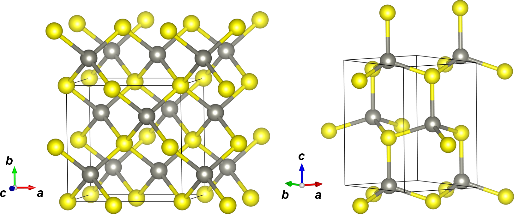
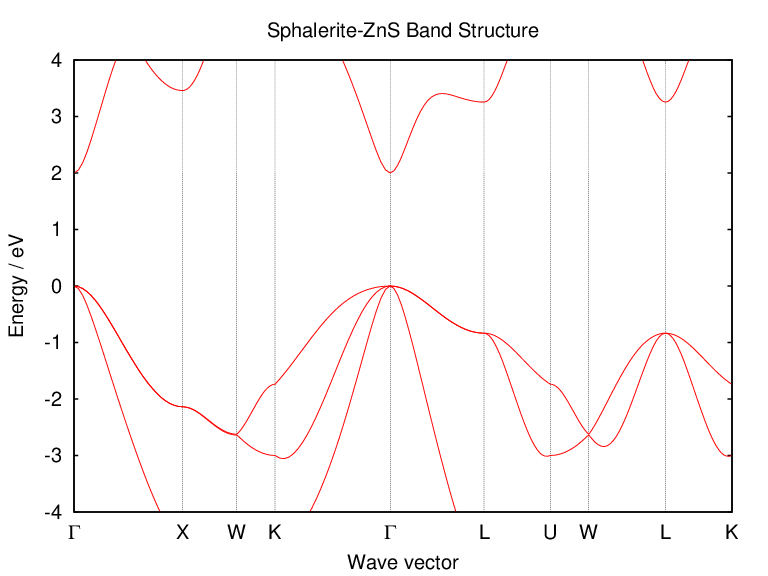

# Illustrations of Quantum Espresso calculations
[Quantum Espresso](https://www.quantum-espresso.org/) is an integrated suite of Open-Source codes for electronic structure calculations. It is based on density functional theory, plane waves, and pseudopotentials. This document 
illustrates the basic use of Quantum Espresso (`QE`) for tasks such as geometry 
optimizations, energy comparisons, and analysis of band structure.

## Installing Quantum Espresso

### Fedora
To install `QE` on Fedora Linux distribution, simply open a terminal and execute
```
dnf install quantum-espresso
```
after which you can run `QE` jobs as follows:
```
pw.x -i input.in > output.out
```
If you want to run `QE` with several CPU cores, you need to install
the MPI version by executing
```
dnf install quantum-espresso-openmpi
```
This installs the MPI parallel version of `QE`. A parallel
job with four CPU cores (`-np 4`) can be run with 
```
module load mpi/openmpi
mpirun -np 4 pw.x_openmpi -i input.in > output.out
```

### Conda (Other Linux distributions, macOS, and Windows Subsystem for Linux)
If you do not have Conda open source package management system installed, please [install Conda first](../conda.md).

`QE` Conda installation involves many packages and the safest choice is to install it in a new Conda environment. Start by (1) creating a new Conda environment called `qe`, (2) activating it, and (3) installing the latest `QE` version:
```
conda create --name qe
conda activate qe
conda install -c conda-forge qe 
```
After this, you can run `QE` jobs as follows:
```
pw.x -i input.in > output.out 
```
You can deactivate the `qe` Conda environment any time by executing
```
conda deactivate
```
By default, the `conda` version uses all available CPU cores during 
certain parts of the calculation. At the moment this is not recommended 
as it does not improve the performance. To turn off this behavior, 
execute `export OMP_NUM_THREADS=1` after activating the `qe` Conda
environment:
```
conda activate qe
export OMP_NUM_THREADS=1
pw.x -i input.in > output.out 
pw.x -i input2.in > output2.out
```
The `QE` version installed by Conda has been parallelized with MPI
and parallel jobs with four CPU cores (`-np 4`) can be run with 
```
conda activate qe
export OMP_NUM_THREADS=1
mpirun -np 4 pw.x -i input.in > output.out 
mpirun -np 4 pw.x -i input2.in > output2.out 
```

## Installing GBRV pseudopotentials
To run DFT calculations with `QE`, we need pseudopotentials that
have been developed for the DFT exchange-correlation functional used in
our calculations. In the examples here, we use the ultrasoft
[GBRV pseudopotentials](https://www.physics.rutgers.edu/gbrv/) and DFT-PBE.
By default, `QE` searches for pseudopotentials in the directory 
`$HOME/espresso/pseudo` and the version 1.5 of the GBRV pseudopotentials 
can be installed there by executing
```
mkdir -p $HOME/espresso/pseudo
cd $HOME/espresso/pseudo
wget https://www.physics.rutgers.edu/gbrv/all_pbe_UPF_v1.5.tar.gz
tar xfz all_pbe_UPF_v1.5.tar.gz
rm all_pbe_UPF_v1.5.tar.gz
```
More pseudopotentials and detailed benchmark data 
for plane-wave+pseudopotential DFT calculations are available at
[Standard solid-state pseudopotentials (SSSP)](https://www.materialscloud.org/discover/sssp/)

## Example 1: Sphalerite and wurtzite polymorphs of Zinc(II) sulfide, ZnS
ZnS crystallizes in two principal forms, sphalerite (left) and wurtzite (right):



Sphalerite is a naturally occurring mineral belonging to the cubic crystal system with 
space group *F*-43*m* (No. 216). Both Zn and S atoms are tetrahedrally
coordinated in the sphalerite structure and the crystal structure can
be considered as a diamond lattice with two atom types. 
Wurtzite is also a naturally occurring mineral and it can be considered as a hexagonal polymorph of sphalerite, 
crystallizing in the space group *P*6<sub>3</sub>*mc* (No. 186). The 
coordination with nearest and next-nearest neighbors in the wurtzite is 
identical to sphalerite and only in the third shell of neighbors the 
first structural differences arise [(see for example Gilbert *et al.*)](https://doi.org/10.1103/PhysRevB.66.245205)

From thermodynamical point of view, sphalerite is the low-temperature 
ZnS polymorph in bulk form and the transition temperature to wurtzite 
is  1293 &plusmn; 10 K  [(see for example Gardner and Pang)](https://doi.org/10.1039/F19888401879).
Wurtzite-ZnS is thus metastable at room temperature, but it occurs in 
the nature and can be produced synthetically. 

The calculations below will be run with the DFT-PBE functional and GBRV pseudopotentials. The ultrasoft GBRV pseudopotentials have been designed for the following plane-wave kinetic  energy cutoffs throughout the periodic table: 40 Ry for wavefunctions and 200 Ry for charge density and potential.

### From a crystal structure to Quantum Espresso input file
To study sphalerite-ZnS and wurtzite-ZnS with `QE`, we need their crystal structures.
A good source for crystal structure data is the [Crystallography Open Database](http://www.crystallography.net/cod/). The crystal structures of
sphalerite-ZnS and wurtzite-ZnS can be found for example with COD IDs 
9000107 and 9008878, respectively (`Search -> elements: Zn and S -> distinct elements:
max 2 -> Send`). The crystal structures can then be downloaded in as CIF files.

There are several ways to enter the crystal structures in `QE` input files.
We will utilize here the "crystallographic" approach, where we can directly
use the information in the CIF files. Other approaches are documented in the
[QE manual](https://www.quantum-espresso.org/Doc/INPUT_PW.html). Another
very helpful resource is the [Quantum ESPRESSO input generator and structure visualizer](https://www.materialscloud.org/work/tools/qeinputgenerator) offered
by the [Materials Cloud](https://www.materialscloud.org/).

The CIF files and corresponding full annotated `QE`input files can be found from the subdirectories `zns_sphalerite` and `zns_wurtzite`. 
Using the sphalerite polymorph as an example, the following
structural information is required in the `QE` input:

```
&SYSTEM
  space_group=216 ! Space group number
  a=5.4093        ! Lattice parameter a in angstroms
  nat=2           ! Number of atoms in the asymmetric unit
ATOMIC_POSITIONS crystal_sg
Zn 0.00000 0.00000 0.00000
S  0.25000 0.25000 0.25000
```

### Converging reciprocal space *k*-sampling for sphalerite
Before geometry optimizations, it is
important to decide how dense *k*-sampling of the reciprocal space is needed
to describe the materials accurately enough. The 
`QE` input generator mentioned above suggests a 7x7x7 Monkhorst-Pack *k*-grid for
"normal" accuracy (when using pymatgen CIF parser that correctly generates
the input file using the primitive cell). Let's investigate the convergence
with respect to *k*-sampling in the case of sphalerite-ZnS.

Subdirectory `zns_sphalerite/kmesh` contains four `QE` inputs that calculate the single-point energy for sphalerite-ZnS at the experimental geometry 
using different *k*-grids: 2x2x2, 4x4x4, 8x8x8, and 12x12x12. 
Run the calculations by executing the 
```
./run.sh
```
The jobs should take from few seconds to few minutes to finish. 
After they have finished, you can look at the timings by executing
```
grep 'PWSCF.*WALL' *out
```
which should return something like
```
zns_sphalerite_exp_k1_222.out:     PWSCF        :      2.73s CPU      2.93s WALL
zns_sphalerite_exp_k2_444.out:     PWSCF        :      3.26s CPU      3.47s WALL
zns_sphalerite_exp_k3_888.out:     PWSCF        :      8.18s CPU      8.44s WALL
zns_sphalerite_exp_k4_121212.out:  PWSCF        :     17.55s CPU     17.85s WALL
```
(the timings will vary based on the used computer). The total energies with different
*k*-samplings can be obtained by executing
```
grep '!' zns*out
```
which should return something like
```
zns_sphalerite_exp_k1_222.out:!    total energy              =    -485.67825763 Ry
zns_sphalerite_exp_k2_444.out:!    total energy              =    -485.76692472 Ry
zns_sphalerite_exp_k3_888.out:!    total energy              =    -485.77032719 Ry
zns_sphalerite_exp_k4_121212.out:! total energy              =    -485.77034897 Ry
```
These data mean that when the *k*-grid is increased from 2x2x2 to 4x4x4, the total energy
decreases by 0.08867 Ry = 116.4 kJ/mol. This is a significant change,
illustrating how inadequate a *k*-sampling of 2x2x2 would be. Going from
a 4x4x4 to a 8x8x8 *k*-grid, the energy still decreases by 0.00340 Ry = 4.5 kJ/mol. Finally,
increasing the *k*-grid from 8x8x8 to 12x12x12 decreases the total energy only by 
0.00002 Ry = 0.03 kJ/mol. This is already a small difference considering the overall
accuracy of the used DFT-PBE method, showing that the 8x8x8 *k*-grid provides
a reasonable accuracy. Increasing the mesh to 12x12x12 doubles the computational
time with little improvement in accuracy.

### Geometry optimization of sphalerite-ZnS
Directory `zns_sphalerite` contains the `QE` input file 
`zns_sphalerite_opt.in` that optimizes the geometry of sphalerite-ZnS.
The job runs a `vc-relax` job, that is, optimization of lattice parameters and 
atomic positions within the constraints of the space group symmetry. In the
sphalerite structure, the lattice parameter *a* is actually the only free
structural parameter and the structure could also be "optimized" manually
by scanning the lattice parameter. However, the point here is to illustrate
the typical `QE` workflow, where a geometry optimization is the first
step after all computational parameters have been established.

Run the geometry optimization by executing
```
pw.x -i zns_sphalerite_opt.in > zns_sphalerite_opt.out
```
The job will finish in few minutes. 
In addition to the output file `zns_sphalerite_opt.out`, the job produces 
directory `zns.save`, which contains the optimized geometry and the 
wavefunction of the system at that geometry.

Execute
```
grep '!' zns_sphalerite_opt.out
```
to obtain the total energies during the optimization:
```
!    total energy              =    -485.77032719 Ry
!    total energy              =    -485.77058700 Ry
!    total energy              =    -485.77059686 Ry
!    total energy              =    -485.77059660 Ry
!    total energy              =    -485.77060749 Ry
```
The optimization converges after the fourth step, where the energy is
changing by less than 10<sup>-6</sup> Ry. After that, the final total
energy then shows again a somewhat larger change. This is a final SCF
calculation at the optimized structure, as informed by `QE`:
```
     Final scf calculation at the relaxed structure.
     The G-vectors are recalculated for the final unit cell
     Results may differ from those at the preceding step.
```
In other words, the unit cell has changed during the geometry
optimization, and as certain cutoffs in the calculation have been 
set for the original unit cell, a final SCF calculation for the 
optimized unit cell is needed to obtain the final total energy.

The optimized lattice parameter *a* is 5.447 Å, which is only 0.7% larger
compared to the experimental lattice parameter of 5.409 Å.
The optimized geometry and the change of geometry during the optimization
can be visualized for example with [Jmol](../jmol.md) or 
[XCrySDen](http://www.xcrysden.org/). Note that Quantum Espresso
runs the calculation for the primitive cell with two atoms and the
optimized cell parameters look as follows:

```
CELL_PARAMETERS (alat= 10.22209553)
  -0.503458508   0.000000000   0.503458508
  -0.000000000   0.503458508   0.503458508
  -0.503458508   0.503458508   0.000000000
```

The cell parameters are given in terms of `alat` (in bohr units).
For an FCC lattice, the first lattice vector is `v1 = (a/2)(-1,0,1)`,
where *a* is the optimized lattice parameter
(see `ibrav` keyword in 
[pw.x manual](https://www.quantum-espresso.org/Doc/INPUT_PW.html)). 
In other words, *a*/2 = 10.22209553 bohr \* 0.503458508 = 5.146400964 bohr
and *a* = 5.146400964 bohr \* 2 \* 0.529177210903 Å/bohr = 5.447 Å.

### Geometry optimization of wurtzite-ZnS

Directory `zns_wurtzite` contains the `QE` input file 
`zns_wurtzite_opt.in` for the geometry optimization of wurtzite-ZnS.
The *k*-grid in the input file, 8x8x4, has been set in such way that the
*k*-point density is comparable to the 8x8x8 *k*-grid used for 
sphalerite-ZnS. In the wurtzite structure, there are four free parameters: 
*a*, *c*, and the *z*-coordinates of the Zn and S atoms.

Run the geometry optimization by executing
```
pw.x -i zns_wurtzite_opt.in > zns_wurtzite_opt.out
```
The job requires more optimization steps in comparison to sphalerite-ZnS
and may take even tens of minutes to complete when run using only one CPU
core (MPI parallel version can be used to speed up the calculation, see above).

After the optimization has finished, execute
```
grep '!' zns_wurtzite_opt.out
```
to obtain the total energies during the optimization:
```
!    total energy              =    -971.53752964 Ry
!    total energy              =    -971.53904727 Ry
!    total energy              =    -971.54003501 Ry
!    total energy              =    -971.54005630 Ry
!    total energy              =    -971.54019969 Ry
!    total energy              =    -971.54024034 Ry
!    total energy              =    -971.54028929 Ry
!    total energy              =    -971.54032876 Ry
!    total energy              =    -971.54033289 Ry
!    total energy              =    -971.54033659 Ry
!    total energy              =    -971.54033772 Ry
!    total energy              =    -971.54033247 Ry
!    total energy              =    -971.54033745 Ry
!    total energy              =    -971.54033767 Ry
!    total energy              =    -971.54033770 Ry
!    total energy              =    -971.54033828 Ry
!    total energy              =    -971.54033843 Ry
!    total energy              =    -971.54033852 Ry
!    total energy              =    -971.54033856 Ry
!    total energy              =    -971.54037634 Ry
```
The last energy again shows a relatively large change, but this
is no reason to worry (see above for discussion about the final SCF
calculation).

The optimized lattice parameters *a* and *c* are 3.846 Å and 6.304 Å, respectively.
In comparison to the experimental values, they are 0.9% and 1.1% larger.

### Energy comparison of sphalerite-ZnS and wurtzite-ZnS
Now we have the total energies of both ZnS polymorphs. Because wurtzite-ZnS has
two formula units in the primitive cell and sphalerite-ZnS only one, we need to 
divide the total energy of wurtzite by two before comparing the total energies. The
energy difference per formula unit is:

```
DeltaE = E(wurtzite)/2  - E(sphalerite) 
       = -485.770188 Ry - (-485.770607) Ry
       = 0.000419 Ry 
       = 0.6 kJ/mol
```

This is in good agreement with [Cardona *et al.*](https://doi.org/10.1103/PhysRevB.81.075207), 
who reported an energy difference of less than 0.008 eV (0.8 kJ/mol) per formula unit
 from both DFT-LDA and DFT-GGA calculations on ZnS polymorphs. The energy
 difference is so small because the sphalerite and wurtzite crystal 
 structures are so similar, showing differences only in the third-nearest
 neighbor shell. Note that so far we only compared electronic total energies 
 and Gibbs Free Energies should be considered for full understanding of the
 thermodynamics.

## Example 2: Band structure calculation of sphalerite-ZnS
The second example illustrates how the electronic band structure of
sphalerite-ZnS can be calculated and plotted with `QE`. The starting point is
the optimized geometry in the directory `zns_sphalerite`. For the band
structure calculation, we need the data in the subdirectory `zns.save`. 

The `QE` input file `zns_sphalerite_bands.in` runs a job with job type
`bands`. In the file we use the optimized lattice parameter *a* and ask
`QE`to include 13 valence bands and 7 empty bands in the band structure
calculation. 

In any band structure calculation, the band path in the
reciprocal space has to be defined in terms of *k*-points. The band path
depends on the Bravais lattice of the crystal structure and here we use 
the FCC band path from 
[Setyawan and Curtarolo](https://doi.org/10.1016/j.commatsci.2010.05.010).
We use the band path in a slightly shortened form, Gamma-X–W–K–Gamma–L–U–W–L–K.
A very good source for band paths is the 
[SeeK-path](https://www.materialscloud.org/work/tools/seekpath)
service, which readily provides band paths for several different
program packages based on a crystal structure. However, one should note
that the band paths are provided for crystal structures standardized by
`spglib`. Thus, you should run an additional SCF calculation for the 
standardized crystal structure provided by SeeK-path so that it
perfectly matches the band path provided by SeeK-path.

First, we run the band structure calculation with `pw.x` to obtain
the band energies at each *k*-point included in the band path: 
```
pw.x < zns_sphalerite_bands.in > zns_sphalerite_bands.out
```

Next, the band energies are ordered by `bands.x` into easily plottable
format:
```
bands.x < zns_sphalerite_bandsx.in > zns_sphalerite_bandsx.out
```
The executable `bands.x` produces files `zns_bands.dat` and
`zns_bands.dat.gnu`. The latter file could be used to plot the
band structure with `gnuplot`, but let's produce a nearly complete 
band structure plot with tool called `plotband.x`.

For the final band structure plot, we need the Fermi energy. ZnS is
an insulator with a band gap and thus we will use the 
highest occupied energy level as the Fermi energy. We can obtain
the highest occupied energy level from the geometry optimization
output:

```
grep 'highest occupied level' zns_sphalerite_opt.out | tail -n 1
```
which provides us with:
```
     highest occupied level (ev):     6.4248
```
This energy level was obtained for the *k*-grid used in our
geometry optimization. If the band structure plot would show that
there is actually a higher energy level when one samples the band path,
the energy level could be changed accordingly in the plot.

The input file for `plotband.x`, with some annotations, 
now looks as follows:
```
zns_bands.dat  -> Band energies ordered by bands.x
2.4248 10.4248 -> Emin and Emax. [-4..4] eV with respect to Fermi level.
zns_bands.gnu  -> Input for gnuplot
zns_bands.ps   -> Postscript file
6.4248         -> Fermi level
1.0 6.4248     -> Y-axis step (1 eV), reference energy (Fermi energy)

```

Finally, the `plotband.x` can be executed with:
```
plotband.x < zns_sphalerite_plotband.in > zns_sphalerite_plotband.out
```

`plotband.x` produces a Postscript file `zns_bands.ps` which
is still missing the *k*-vector labels (Gamma-X–W–K–Gamma–L–U–W–L–K)
and Y-axis label (Energy / eV). A complete plot can be prepared for example 
with  `gnuplot` using the following script in file `zns_bands_gnuplot`:
```
set terminal postscript eps size 8,6 enhanced color font 'Helvetica,30' linewidth 2
set output 'zns_bands.eps'

# Fermi level
Eref = 6.4248
set xrange [0.0:6.0240]
set yrange [-4:4]
set xlabel 'Wave vector'
set ylabel 'Energy / eV'
# x-coordinates from plotband.x (file zns_sphalerite_plotband.out)
set xtics ("{/Symbol G}" 0.0, "X" 0.9931, "W" 1.4897, "K" 1.8408, "{/Symbol G}" 2.8942, "L" 3.7543, "U" 4.3624, "W" 4.7136, "L" 5.4158, "K" 6.0240) scale 0
set grid xtics
set title 'Sphalerite-ZnS Band Structure'
plot "zns_bands.gnu" using 1:(column(2)-Eref) with lines notitle
```

The resulting band structure looks as follows:



From the band structure plot we can see that sphalerite-ZnS has a direct band
gap of about 2 eV at the Gamma point when using the DFT-PBE method and GBRV
pseudopotentials. The band structure compares well with the
DFT-PBE band structure available in the 
[Materials Project](https://materialsproject.org/materials/mp-10695/), but
the band gap is severely underestimated in comparison to the
[experimental band gap of about 3.8 eV (at 10 K)](https://doi.org/10.1063/1.363937).
The agreement with the experiment could be improved for example with the 
DFT+U approach or using hybrid density functional methods.