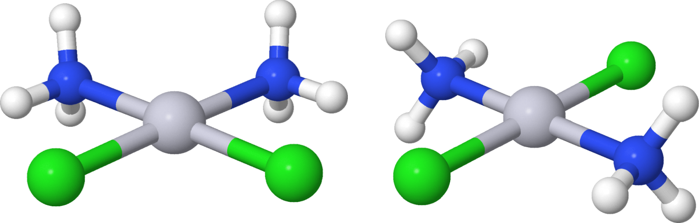
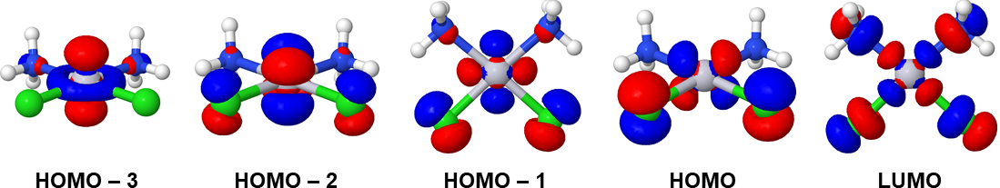

# Illustrations of xtb calculations
The primary design goal of [xtb](https://xtb-docs.readthedocs.io/) has been the fast calculation of structures
and noncovalent interaction energies for molecular systems with roughly up to 1000 atoms.
Even though the GFNn-xTB methods implemented in `xtb` are parametrized semiempirical quantum chemical methods,
they are widely applicable as they are parametrized up to radon (Z = 86).

This document illustrates the basic use of `xtb` for structural optimizations and energy comparisons.
Conformational analysis with the help of the [crest](https://xtb-docs.readthedocs.io/en/latest/crest.html)
program is discussed, as well.

## Installing xtb

### Fedora
To install `xtb` on Fedora Linux distribution, simply open a terminal and execute
```
dnf install xtb
```
after which you can run `xtb` jobs as follows:
```
xtb molecule.xyz --opt > molecule.out
```

### Conda (Other Linux distributions, macOS, and Windows Subsystem for Linux)
If you do not have Conda open source package management system installed, please [install Conda first](../conda.md).

To install `xtb` into the currently active Conda environment, 
open a terminal and execute
```
conda install -c conda-forge xtb
```
after which you can run `xtb` jobs as follows:
```
xtb molecule.xyz --opt > molecule.out
```

## Example 1: Cisplatin and Transplatin
[Cisplatin](https://en.wikipedia.org/wiki/Cisplatin), cis-\[Pt(NH<sub>3</sub>)<sub>2</sub>Cl<sub>2</sub>\], is a chemotherapy medication
used in cancer treatments. It also has a stereoisomer [transplatin](https://en.wikipedia.org/wiki/Transplatin),
trans-\[Pt(NH<sub>3</sub>)<sub>2</sub>Cl<sub>2</sub>\],
which is not effective in cancer treatment. The figure below shows the structures of cisplatin (left) and transplatin (right):



Let's study cisplatin and transplatin with `xtb`.

### Cisplatin
Enter the directory with cisplatin coordinate file `cisplatin.xyz` (XYZ format):
```
cd cisplatin
```
The geometry in the file `cisplatin.xyz` has been hand-built with a 3D molecular editor and is not at a minimum point of the
potential energy surface (PES). The point group of the initial geometry is approximately *C<sub>2v</sub>*, but symmetry is not
enforced during the `xtb` calculations. In general, initial geometries can be obtained from structural databases
such as Pubchem or manually built with 3D molecular editors such as Jmol, Avogadro, or IQMol.

The first task is to bring the molecule into a (local) minimum of the PES.
Optimize the geometry of the cisplatin molecule by executing:
```
xtb cisplatin.xyz --gfn 2 --opt tight --parallel 1 > cisplatin.out
```
Short explanation of the used command line parameters:
- `--gfn 2` requests the GFN2-xTB level of theory. This is actually the default,
but here we specify it here for clarity.
- `--opt tight` requests geometry optimization with tight convergence criteria.
- `--parallel 1` asks `xtb` to use only one CPU. For a small molecule like Cisplatin,
calculations actually run faster with just one CPU because parallelization always adds some overhead.
For larger systems, it makes sense to use more CPUs, but one should not exceed the number of physical CPU cores
in the computer.

The geometry optimization finishes in a few seconds and produces a number of files:
- `xtbopt.xyz` contains the optimized geometry in XYZ format (can be opened for example in Jmol or Avogadro).
- `xtbopt.log` contains XYZ coordinates for all optimization steps
- `cisplatin.out` contains the output from `xtb`

From the output file `cisplatin.out` we see that the structural optimization took 20 iterations (steps):
```
   *** GEOMETRY OPTIMIZATION CONVERGED AFTER 11 ITERATIONS ***
```
Under the section `Bond Distances (Angstroems)`, `xtb` shows that the optimized Pt-Cl
distances are 2.24 Å and the optimized Pt-N distances are 2.15 Å. Considering the relatively low level
of theory, the obtained distances are in reasonable agreement with Pt-Cl distance of 2.25 Å and
Pt-N distance of 2.06 Å obtained with much higher-level coupled cluster methods by
[Barone et al.](https://doi.org/10.1002/anie.201707683)). They also discuss the difficulties in comparing
the gas-phase monomer geometries with the experimentally determined solid-state crystal structure of Cisplatin.

After the geometry optimization has converged, `xtb` runs a final *single-point* calculation
at the optimized geometry and produces a summary:
```
         :::::::::::::::::::::::::::::::::::::::::::::::::::::
         ::                     SUMMARY                     ::
         :::::::::::::::::::::::::::::::::::::::::::::::::::::
         :: total energy             -22.611353289776 Eh    ::
```
The total energy printed here is the total energy of the cisplatin molecule at the
optimized geometry. The absolute energy as such does not yield chemical insights. But
we will soon use the total energy to compare the relative energies of cisplatin and transplatin.

### Transplatin
If you are located at the directory `cisplatin`, go back to the parent directory with
```
cd ..
```
Enter the directory with transplatin coordinate file `transplatin.xyz` (XYZ format):
```
cd transplatin
```
The point group of the initial geometry is approximately *C<sub>2h</sub>*, but symmetry is not
enforced during the geometry optimization. Optimize the geometry of the transplatin molecule by executing:
```
xtb transplatin.xyz --gfn 2 --opt tight --parallel 1 > transplatin.out
```
The geometry optimization takes eight iterations, finishing in a few seconds and producing similar output files as in the case of
cisplatin. Now the main output file is called `transplatin.out`.

In the section `Bond Distances (Angstroems)`, Pt-Cl distances are 2.30 Å and Pt-N distances are 2.05 Å.
Similarly to cisplatin, the final summary yields the total energy of the transplatin molecule at the optimized geometry:
```
         :::::::::::::::::::::::::::::::::::::::::::::::::::::
         ::                     SUMMARY                     ::
         :::::::::::::::::::::::::::::::::::::::::::::::::::::
         :: total energy             -22.618809235400 Eh    ::
```

Now, we can compare the total energies of cisplatin and transplatin (the conversion factor from Hartree to kJ/mol is 2625.5).
```
Erel = E(Cisplatin)        -  E(Transplatin)
     = -22.611353289776 Eh - (-22.618809235400 Eh)
     =   0.007455945624 Eh
     = 20 kJ/mol
```

The total energy of transplatin is lower (more negative). This means that transplatin is the
energetically more favorable stereoisomer of diamminedichloroplatinum(II), \[Pt(NH<sub>3</sub>)<sub>2</sub>Cl<sub>2</sub>\].
The energy difference between the isomers is 20 kJ/mol. For comparison, [Liu and Franke](https://doi.org/10.1002/jcc.10030),
reported an energy difference of 56 kJ/mol with a much higher level of theory (CCSD(T) with 13s9p7d5f2g basis for Pt and
aug-cc-pVQZ for other elements). The result from `xtb` is in good qualitative or semiquantitative agreement with the result
obtained with the high level of theory. With `xtb`, we were able to obtain this semiquantitative result within a matter of seconds.

## Example 2: Molecular orbitals
This example illustrates how `xtb` can be used to produce molecular orbitals that can be visualized with `Jmol`.

### Generating molecular orbitals with `xtb`
Go to the `cisplatin` directory, where the structure of cisplatin was optimized. Run `xtb` to generate
molecular orbitals in Molden format:
```
xtb xtbopt.xyz --molden --parallel 1 > xtb-molden.out
```
The calculation finishes almost immediately and produces file `molden.input`.
It is recommended to give the Molden file a more descriptive name:
```
mv molden.input cisplatin.molden
```

### Visualizing orbitals in Jmol
Open the file `cisplatin.molden` in Jmol ([installation instructions for
Jmol are available](../jmol.md)). Open `File -> Console` and execute 
the following command to visualize the highest occupied MO with 
isovalue 0.04 e-/bohr^3:
```
isosurface cutoff 0.04 resolution 10 mo 20
```
Within the `xtb` calculation, cisplatin has 40 electrons 
and occupied 20 MOs (only the valence electrons are explicitly considered by `xtb`).

The four highest occupied MOs (HOMOs) and the lowest unoccupied MO (LUMO) look as follows:



From the point of view of [crystal field theory](https://chem.libretexts.org/Bookshelves/Inorganic_Chemistry/Supplemental_Modules_and_Websites_(Inorganic_Chemistry)/Crystal_Field_Theory/Crystal_Field_Theory), the Pt(II) atom in cisplatin has square planar coordination and eight 5d electrons. The four HOMOs and the LUMO all involve Pt 5d orbitals. `xtb` employs parametrized semiempirical quantum chemical methods, but in line with the crystal field theory, the LUMO involves the Pt 5d<sub>x2-y2</sub> orbital. HOMO-3 involves the Pt 5d<sub>z2</sub> orbital, while the 5d<sub>xy</sub>, 5d<sub>xz</sub>, and 5d<sub>yz</sub> orbitals contribute to HOMO-2, HOMO-1, and HOMO. 

## Example 3: Conformational analysis of methylcyclohexane
`xtb` can be combined with [crest](https://xtb-docs.readthedocs.io/en/latest/crest.html) program
(Conformer-Rotamer Ensemble Sampling Tool). `crest` employs the `xtb` program to carry out
confromational searches of molecules.

### Installation of `crest`
To run `crest`, it is enough to download the binaries:
```
mkdir -p $HOME/crest
cd $HOME/crest
wget https://github.com/grimme-lab/crest/releases/download/v2.11/crest.tgz
tar xvfz crest.tgz
```
To run `crest`, `xtb` has to be available.

### Conformational analysis of methylcyclohexane
Let's use [methylcyclohexane](https://chem.libretexts.org/Bookshelves/Organic_Chemistry/Map%3A_Organic_Chemistry_(Vollhardt_and_Schore)/04._Cycloalkanes/4.4%3A_Substituted_Cyclohexanes)
as an example case for `crest`. It is experimentally known that equatorial position of the methyl group is more favorable than
the axial position. The energy difference is about 7.6 kJ/mol, which means that about 95% of methylcyclohexane molecules will have the
methyl group in equatorial position at 25 °C.

Enter the directory with methylcyclohexane coordinate file `methylcyclohexane.xyz`:
```
cd methylcyclohexane
```
Next, we will run a conformational analysis, where `crest` searches for low-lying conformers of
methylcyclohexane. The default energy window (`ewin`) for the conformer search is 6.0 kcal/mol (25.1 kJ/mol).
If you have at least four CPU cores, you can execute the following command:
```
$HOME/crest/crest methylcyclohexane.xyz -v3 -gfn2 -niceprint -T 4 | tee crest.out
```
If you do not have four CPU cores, change the number after the `-T` switch.

Short explanation of the used command line parameters:
- `-v 3` requests version 3 of the conformation analysis workflow. This is currently the default.
- `-gfn2` requests the GFN2-xTB level of theory.
- `-niceprint` produces nicer-looking output during the analysis.
- `-T` determines the number of CPU cores used during the analysis. `crest` runs many independent `xtb` jobs and
therefore it parallelizes very well even for small systems.

The conformational analysis finishes in a few minutes and produces the following output in the end of `crest.out`:

```
 total number unique points considered further :          18
       Erel/kcal        Etot weight/tot  conformer     set   degen     origin
       1   0.000   -22.15355    0.30912    0.92734       1       3     mtd11
       2   0.000   -22.15355    0.30911                                mtd10
       3   0.000   -22.15355    0.30910                                mtd7
       4   1.514   -22.15113    0.02407    0.07221       2       3     mtd7
       5   1.514   -22.15113    0.02407                                mtd4
       6   1.514   -22.15113    0.02407                                mtd4
	   ...
```
The structures 1-3 correspond to the same, lowest-energy conformer (chair conformation, methyl group
in equatorial position). The structures 4-6 correspond to the second-lowest conformer in energy 
(chair conformation, methyl in axial position). The energy difference is 1.514 kcal/mol (6.3 kJ/mol) and 
93% of the methylcyclohexane molecules are in the lowest-energy conformation (by default, 
the analysis was carried at room temperature). The result of the conformational analysis
is in good agreement with the experimental observations discussed above. The file `crest.energies`
contains the energy data and file `crest_conformers.xyz` contains the structures of the conformers.
They can be visualized in any program that can open XYZ files.
